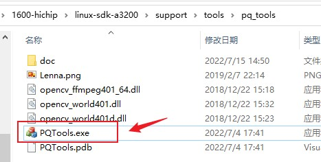
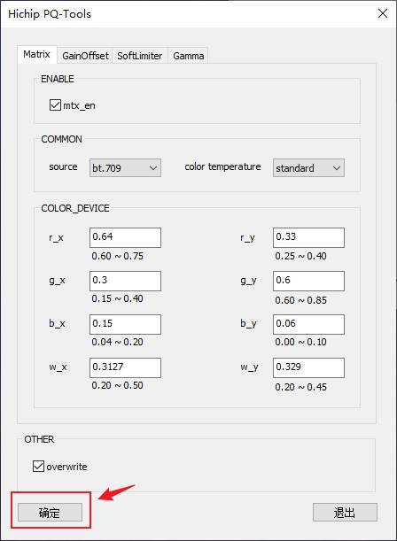
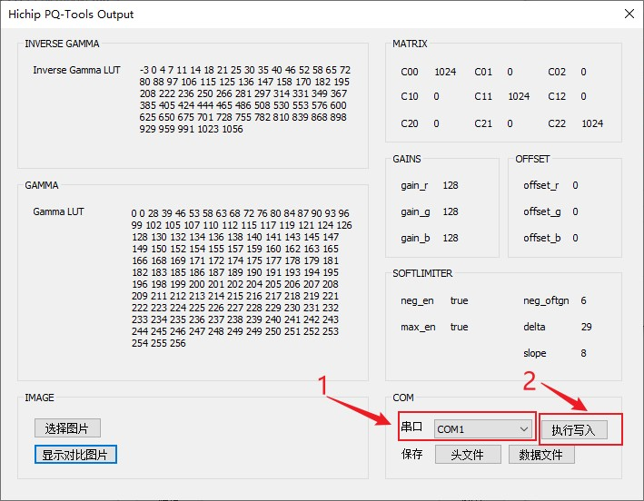
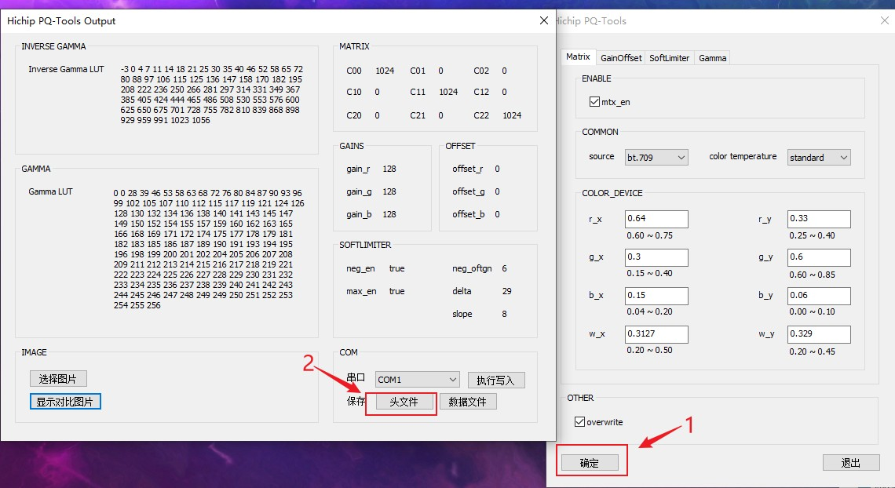

# 1600 PQ工具使用说明

## 在PC上使用PQ_Tools配置PQ参数说明

### Linux SDK编译配置

#### linux 配置 USB驱动

* linux menuconfig 所需要打开的宏
    * **USB_GADGET**
    * **USB_GADGETFS**
    * **USB_CONFIGFS**
    * **CONFIGFS_FS**
    * **USB_LIBCOMPOSITE**
    *  **USB_G_SERIAL**
    * 另外需要在menuconfig中指定好此时usb口到底是host还是gadget
        *  **USB_MUSB_DUAL_ROLE** 设为 y
* dts修改 *hc16xx-common.dtsi*
    * **usb_host0**或者**usb_host1**的节点 **dr_mode**改为 "host"

####  avp使能pq模式

*   avp-menconfig中使能
    *   **CONFIG_CMDS_PQ**

#### 编译

完成上述配置后, 输入以下编译命令

```shell
make avp-cmds-rebuild avp-all avp-rebuild linux-rebuild all
```


### 板端命令行输入命令

开发板进入命令行后, 依次输入以下命令

```shell
## 进入命令行, 输入密码root进入系统
root

## 将USB#0切换为usb device模式, 并加载usb串口驱动
## 加载成功和插入usb#0之后, 此时windows的设备管理器就会现在一个新的串口
$ echo "peripheral" > /sys/devices/platform/soc/18844000.usb/musb-hdrc.0.auto/mode
$ modprobe g_serial

## 进入avp cpu的控制命令行, 启动pq_start
$ avpconsole
$ pq_start
$ quit      ## 退出avp cpu 的命令行模式, 回来main cpu的命令行

## pq工具使用说明
$ pq_tool &      ## '&'表示在后台运行pq工具
# 其他选项说明
$ pq_tool -h    ## 查看pq工具的help说明
$ pq_tool -d    ## 运行pq工具, 同时会列出所接收到的raw data

## 播放U盘的图片
$ ls /media/hdd    ## 查看U盘目录下有什么文件
$ cd /media/hdd
$ mplayer
$ play xxxx.jpg     ## 播放某张图片
$ stop 				## 暂停播放图片
```


### PC端使用PQ_Tools

1.   板端上完成输入上述的命令后, 就可以通过PC上运行PQ_Tools来配置参数

2.   PC端上打开 **PQTools.exe**, 具体的PQ参数配置说明请见另一篇文档

     

3.   完成具体参数配置后,  如下图所示点击 ***确认***

     

4.    然后选择板端USB所虚拟出来的串口(具体串口号可以在windows的设备管理器上查看), 然后点击 ***执行写入***,  **此时显示设备就能显示出参数配置后的效果**

     

## 在源码上配置PQ参数说明

除了通过上述的PC端的PQ工具, 我们也能使用PQ工具所生成的头文件, 在源码中配合使用对应的API来配置.  

具体例程源码可以参考 Linux SDK的 `SOURCE/avp/components/cmds/source/pq/pq_test.c`

1.   在PC端的PQ_TOOL上, 我们可以通过下图的方式获取到所配置好的参数所对应的**.h头文件**, 默认名字为 `sample.h`



2.   然后我们在源码中包含这个所生成的**.h头文件**, 那么就能按照以下方式去使用

```c
#include <fcntl.h>
#include <unistd.h>
#include <stdio.h>
#include <sys/ioctl.h>
#include <sys/types.h>
#include <hcuapi/common.h>
#include <hcuapi/pq.h>

#include "sample.h"   // 这是上述所提到的PQ工具所生成的.h头文件

{
    ...
    int pq_fd = open("/dev/pq" , O_WRONLY);
    if(pq_fd < 0)
        return -1;
    
    //pqReg 正是上面头文件中所定义的具体数据
    ioctl(pq_fd, PQ_SET_PARAM, &pqReg);  
    
    // 先后使用ioctrl命令 PQ_SET_PARAM 和 PQ_START即可将具体pq参数生效
    ioctl(pq_fd, PQ_START);				 
 	...
}
```

